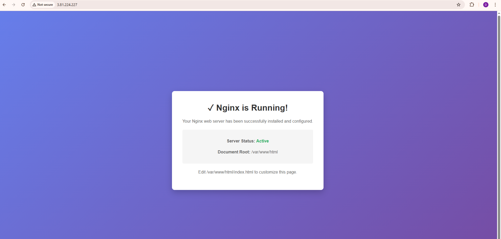
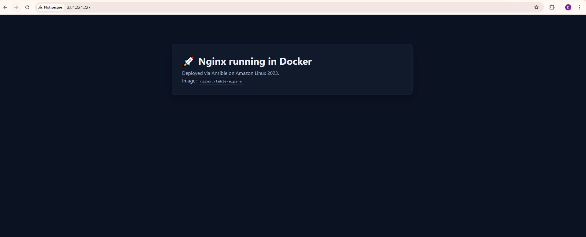
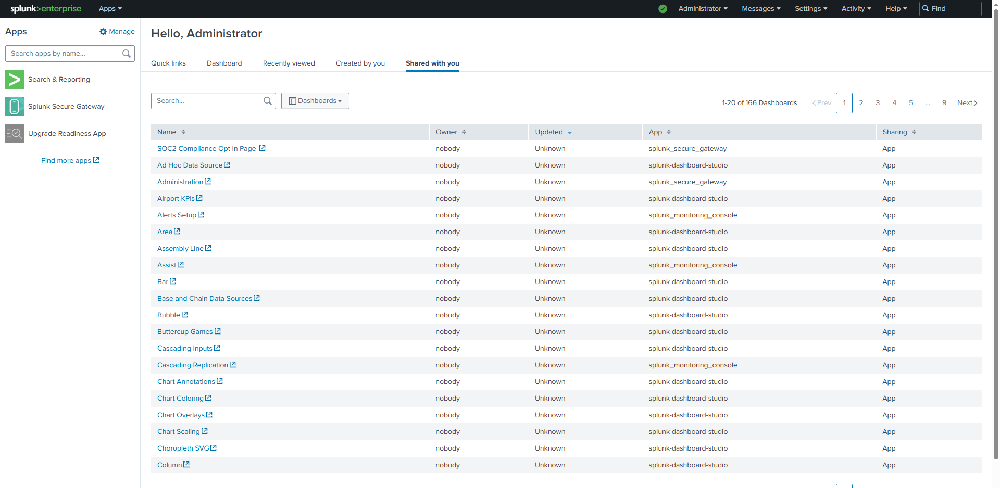

# EC Ansible Nginx Setup

This repository contains Ansible playbooks and roles to install and configure Nginx on AWS EC2 instances running Amazon Linux 2023.

## Project Structure

```
.
├── ansible.cfg              # Ansible configuration
├── inventory/               # Inventory files
│   └── hosts               # EC2 hosts definition
├── roles/                  # Reusable Ansible roles
│   └── nginx/              # Nginx web server role
│       ├── tasks/
│       ├── templates/
│       └── defaults/
├── playbooks/              # Ansible playbooks
│   └── install_nginx.yml
└── README.md              # This file
```

## Prerequisites

### On Your Local Machine
- Ansible installed (`pip3 install ansible`)
- AWS EC2 instance running Amazon Linux 2023
- EC2 security group allowing:
  - SSH (port 22) for Ansible
  - HTTP (port 80) for web traffic
  - HTTPS (port 443) for HTTPS traffic
- EC2 key pair (.pem file)

### On EC2 Instance
- Python 3 (pre-installed on Amazon Linux 2023)
- Internet access

## Quick Start

### 1. Clone the Repository

```bash
git clone https://github.com/alokraja075/ec_ansbe.git
cd ec_ansbe
```

### 2. Update Inventory

Edit `inventory/hosts` with your EC2 instance details:

```ini
[webservers]
ec2-web ansible_host=YOUR_EC2_IP ansible_user=ec2-user ansible_ssh_private_key_file=/path/to/key.pem
```

Replace:
- `YOUR_EC2_IP` with your actual EC2 public IP
- `/path/to/key.pem` with path to your key file

### 3. Test Connectivity

```bash
ansible all -i inventory/hosts -m ping
```

Expected output:
```
ec2-web | SUCCESS => {
    "changed": false,
    "ping": "pong"
}
```

### 4. Run Playbook

```bash
ANSIBLE_ROLES_PATH=./roles ansible-playbook -i inventory/hosts playbooks/install_nginx.yml
```

## Playbooks Overview

### 1. install_nginx.yml
Installs and configures Nginx directly on EC2 instances.

**What it does:**
- Installs Nginx using dnf package manager
- Starts the Nginx service
- Enables Nginx to run on system startup

**Run the playbook:**
```bash
ANSIBLE_ROLES_PATH=./roles ansible-playbook -i inventory/hosts playbooks/install_nginx.yml
```

**Execution Result:**



**Result Summary:**
- ✓ Nginx installed successfully
- ✓ Nginx started and enabled
- ✓ Exit code: 0 (success)

---

### 2. install_nginx_docker.yml
Installs Docker and runs Nginx in a Docker container on EC2 instances.

**What it does:**
- Installs Docker using the docker role
- Pulls and runs Nginx container
- Configures container networking and volume mounts

**Run the playbook:**
```bash
ANSIBLE_ROLES_PATH=./roles ansible-playbook -i inventory/hosts playbooks/install_nginx_docker.yml
```

**Execution Result:**



**Result Summary:**
- ✓ Docker installed successfully
- ✓ Nginx Docker container running
- ✓ Exit code: 0 (success)

---

### 3. install_splunk.yml
Installs and configures Splunk on EC2 instances.

**What it does:**
- Installs Splunk Enterprise
- Initializes Splunk configuration
- Starts Splunk service
- Enables Splunk to run on system startup

**Run the playbook:**
```bash
ANSIBLE_ROLES_PATH=./roles ansible-playbook -i inventory/hosts playbooks/install_splunk.yml
```

**Execution Result:**



**Result Summary:**
- ✓ Splunk installed successfully
- ✓ Splunk service started and enabled
- ✓ Exit code: 0 (success)

---

### 4. install_prometheus.yml
Installs Prometheus (and Node Exporter) on EC2 instances.

**What it does:**
- Downloads Prometheus from official GitHub releases
- Installs `prometheus` + `promtool` into `/usr/local/bin`
- Writes config to `/etc/prometheus/prometheus.yml`
- Runs Prometheus via systemd on port `9090`
- (Optional) Installs Node Exporter on port `9100`

**Run the playbook:**
```bash
ANSIBLE_ROLES_PATH=./roles ansible-playbook -i inventory/hosts playbooks/install_prometheus.yml
```

**Common overrides (examples):**
```bash
# Disable node exporter
ANSIBLE_ROLES_PATH=./roles ansible-playbook -i inventory/hosts playbooks/install_prometheus.yml \
  -e prometheus_install_node_exporter=false

# Add an extra scrape target
ANSIBLE_ROLES_PATH=./roles ansible-playbook -i inventory/hosts playbooks/install_prometheus.yml \
  -e 'prometheus_extra_scrape_configs=[{"job_name":"my-app","static_configs":[{"targets":["localhost:8080"]}]}]'
```

---

### 5. install_kind.yml
Installs `kind` and `kubectl`, then creates a local Kubernetes cluster using Docker.

**What it does:**
- Installs Docker and starts the Docker service
- Downloads `kubectl` and `kind` binaries to `/usr/local/bin`
- Creates a kind cluster (default name: `kind`)
- Writes kubeconfig to `/home/ec2-user/.kube/config`

**Run the playbook:**
```bash
ANSIBLE_ROLES_PATH=./roles ansible-playbook -i inventory/hosts playbooks/install_kind.yml
```

**Verify on the EC2 instance:**
```bash
kubectl get nodes
```

Note: kind is primarily for local/dev clusters. If you need to access the Kubernetes API server from outside the instance, you’ll typically want a custom kind config to expose/mmap the API server port.

## Accessing Your Services

After the playbook completes, you can access:

- **Nginx (Direct):** `http://YOUR_EC2_IP`
- **Nginx (Docker):** `http://YOUR_EC2_IP`
- **Splunk:** `http://YOUR_EC2_IP:8000` (default Splunk web port)
- **Prometheus:** `http://YOUR_EC2_IP:9090`
- **Node Exporter:** `http://YOUR_EC2_IP:9100/metrics`
- **SonarQube (Docker):** `http://YOUR_EC2_IP:9000`

Make sure your EC2 security group allows inbound access to ports `9090` (Prometheus) and optionally `9100` (Node Exporter).

For SonarQube, allow inbound access to port `9000`.

---

### 5. install_sonarqube_docker.yml
Runs SonarQube in Docker with a PostgreSQL container for persistence.

**What it does:**
- Installs Docker (dnf) and starts the Docker service
- Sets required sysctl values for SonarQube (embedded Elasticsearch)
- Runs `postgres` container + `sonarqube` container on a dedicated Docker network
- Persists SonarQube data under `/opt/sonarqube`

**Run the playbook:**
```bash
ANSIBLE_ROLES_PATH=./roles ansible-playbook -i inventory/hosts playbooks/install_sonarqube_docker.yml
```

**Login:**
- URL: `http://YOUR_EC2_IP:9000`
- Default credentials: `admin` / `admin` (you will be prompted to change it)

## Nginx Commands

Check on the EC2 instance:
```bash
# Check status
sudo systemctl status nginx

# Restart
sudo systemctl restart nginx

# Stop
sudo systemctl stop nginx

# Start
sudo systemctl start nginx

# View config
cat /etc/nginx/nginx.conf

# View logs
sudo tail -f /var/log/nginx/access.log
sudo tail -f /var/log/nginx/error.log
```

## Troubleshooting

### Connection Failed
- Check EC2 security groups allow port 22 (SSH)
- Verify key pair permissions: `chmod 400 your-key-pair.pem`
- Test SSH: `ssh -i your-key-pair.pem ec2-user@YOUR_EC2_IP`

### Website Not Accessible
- Check security group allows port 80 (HTTP)
- Verify Nginx is running: `sudo systemctl status nginx`
- Check web root permissions: `ls -la /var/www/html`

### Ansible Connectivity Issues
```bash
# Run with verbose output
ANSIBLE_ROLES_PATH=./roles ansible-playbook -i inventory/hosts playbooks/install_nginx.yml -v
```

## Next Steps

1. **Add SSL Certificate** - Use Let's Encrypt for HTTPS
2. **Upload Content** - Add your own HTML/CSS/JS files
3. **Configure Domains** - Point domain to EC2 IP
4. **Monitor** - Set up CloudWatch metrics
5. **Auto-scaling** - Create AMI and scale instances

## References

- [Ansible Documentation](https://docs.ansible.com/)
- [Nginx Documentation](https://nginx.org/en/docs/)
- [AWS EC2 Documentation](https://docs.aws.amazon.com/ec2/)

## License

MIT License - See LICENSE file
